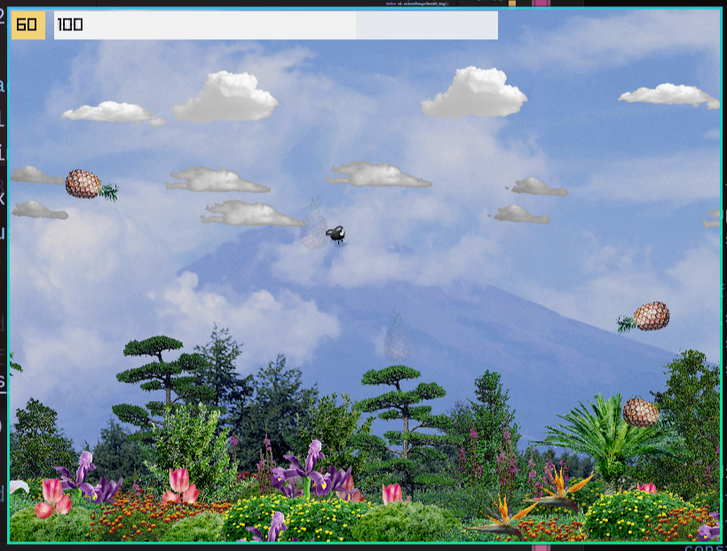

# Raylib/Zig Engine

By Krzysztof Krystian Jankowski



## About

## Tech
- Zig Lang
- Raylib
- Japan Image and Audio Disks
- Gimp
- Zed

## Building
```
zig build run
zig build -Doptimize=ReleaseSmall upx
zig build -Dtarget=x86_64-windows -Doptimize=ReleaseSmall
zig build -Dtarget=x86-windows -Doptimize=ReleaseSmall
```

## Images Sources
- Tenkei Koubou - Trees Textures 1
- Image Land - Clouds Vol.1
- VisualDisk N-3 Mountains
- VisualDisk N-4 The Sun

## Audio Sources
- GU - Onsai - Royalty Free Digital Sound Library
